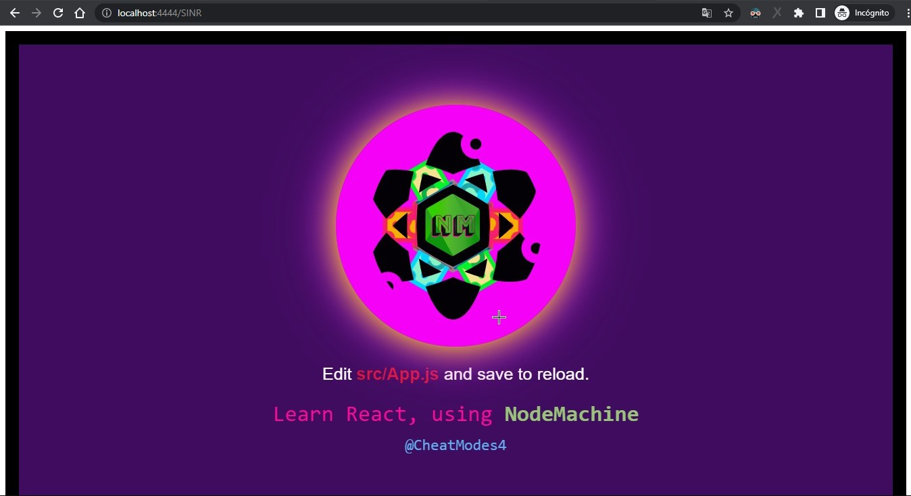
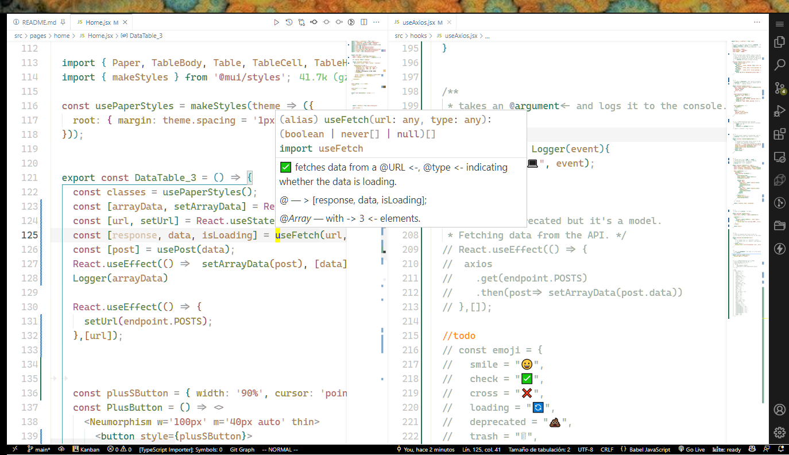

# SISTEMAS INTELIGENTES EN RED -> SINR

#### Crear carpeta y estructura standard basica

```js
mkdir proyecto -> Crea la carpeta proyecto

// Dentro de la carpeta clonar mi repositorio nodemachine
git clone https://github.com/rroderickk/nodemachine

// Entrar a carpeta nodemachine y ejecutar el comando
npm run start                           //?-> Para ver la salida de este proceso leer el archivo ->log<-

// Posteriormente en la carpeta SINR
npm i -D                                //?-> Instala dependencias
npm run start                           //-> Ejecuta el proceso de desarrollo

// Todo este proceso me entrega una estructura de proyecto React standard con tecnologia Webpack/Axios

// Luego de ejecutar este script automatizador creado por mi, procedo a limpiar estos archivos y a instalar las dependencias necesarias del proyecto SINR -> Sistemas Inteligentes en Red

```

La estructura basica hasta ahora se ve así:

```js
SINR
  ├───public
  │   └───assets
  └───src
      ├───components
      ├───containers
      ├───context
      ├───hooks
      ├───pages
      └───routes

//! Está estructura cambiara con respecto al tiempo de vida/mantenimiento de esta aplicacion
```

### Usaré las tecnologias descritas en el whitepaper -> React {Hooks,Formik}, MaterialUi, y alguna otra libreria de terceros

En el proceso de desarollo la app despliega en entorno de desarrollo en:

```js
// localhost:[PORT]/[basename]
   localhost:4444/SINR         //-> [PORT] Está especificado en webpack.config.js
```


#### Instalando dependencias y librerias de terceros y continuando con la configuracion standard.

```js
.gitignore
.git

npm install -D @mui/material @emotion/react @emotion/styled && npm install -D formik --save && npm install @mui/x-data-grid
```

#### Entry point

```js
"main": ".src/index.js", //?-> Entry point de la aplicacion
└───routes               //?-> Rutas de la aplicacion
```



#### La estructura de carpetas y JSX

##### Mutable
```js
src/
│   index.js              //?-> Entry Point
│
├───components
│       TemporaryDrawer.jsx
│
├───containers
│       Layer.jsx
│       Layout.jsx
│
├───context
│       AppContext.jsx
│
├───hooks
│       useFullHooks.jsx
│       useInitialState.jsx
│
├───pages
│   ├───home
│   │       config.js
│   │       Home.jsx
│   │
│   ├───nodemachine            //?-> Use NodeMachine
│   │       Logo.svg
│   │       module.css
│   │       NodeMachine.jsx
│   │
│   └───notfound
│           NotFound.jsx
│
└───routes
        App.jsx                //?-> Rutas
```